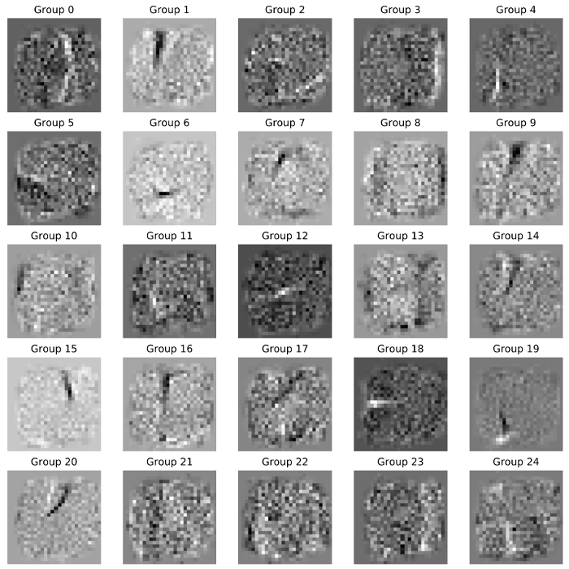
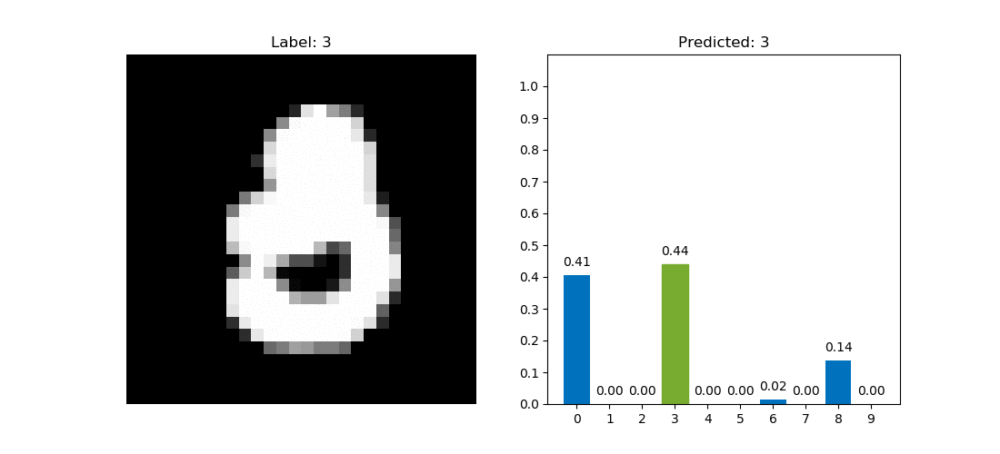

Neural Networks from Scratch
============================

A fully connected two layer neural network in Python implemented on different frameworks with didactic purposes.

    
     
    Hidden layer weights

## Goals

The goals of this project are:

* Build a two hidden layers neural network and supporting functions for training from scratch.
    * `NNfromScratch.py`

* Have a unit testing file to make sure all the neural network code is working as expected.
    * `NNfromScratch_test.py`

* Build a small neural network from scratch with NumPy.
    * `01 -- Digits MNIST - NumPy.ipynb`

* Achieve 99%+ accuracy on the small neural network from scratch with SciPy’s optimization.
    * `02 -- Digits MNIST - SciPy.ipynb`

* Implement a similar network from scratch with the TensorFlow framework.
    * `03 -- Digits MNIST - TensorFlow.ipynb`

* Implement a similar network with the Keras framework and then tune the hyper parameters for better accuracy.
    * `04 -- Digits MNIST - Keras.ipynb`

* Implement an interactive plot to visualize the images and the confidence in their predictions.
    * `05 -- Digits MNIST - Interactive Plot.ipynb`

    

        
         
        Digits MNIST - Interactive Plot
    

* Implement a more complex network using the Neural Network from Scratch library to classify the Fashion MNIST dataset.
    * `In progress...`

## Install & Run

#### 1. Create a new virtual environment with Anaconda:

    $ conda create --name <VIRTUAL_ENV_NAME> jupyter=1.0.0 keras=2.2.4 matplotlib=3.0.3 numpy=1.16.2 pandas=0.24.2 scipy=1.2.1 seaborn=0.9.0 tensorflow=1.12.0 tqdm=4.31.1

#### 2. Activate the new Anaconda virtual environment

    $ conda activate <VIRTUAL_ENV_NAME>

#### 3. Start the jupyter notebook server

    $ jupyter notebook

# Author

Victor Jose Novaes Pires

[https://victorjnpires.github.io/](https://victorjnpires.github.io/)
